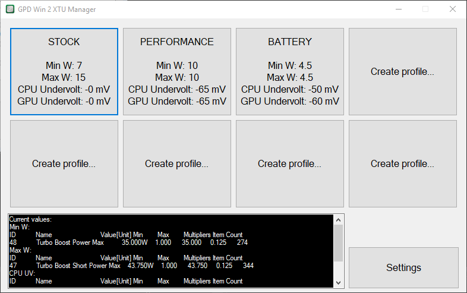
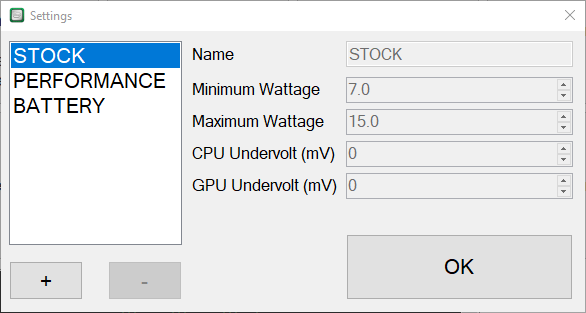

# GPD Win 2 XTU Manager

GPD Win 2 XTU Manager is an application developed by [@BlackDragonBE](https://twitter.com/BlackDragonBE) to make applying XTU (Intel Extreme Tuning Utility) profiles on the GPD Win 2 as easy and fast as possible. This allows you to change the TDP and CPU and GPU undervolts with just a single click!

## How To Use

Download the [newest release ZIP](https://github.com/BlackDragonBE/GPDWin2XTUManager/releases) and unpack it somewhere safe. Now start **GPDWin2XTUManager.exe** with administrator privileges. (it will request this by default)  
  
You'll see the following screen:

By default, there's only the STOCK profile. You can click the button any time to revert back to stock settings.  
To start creating your own profile, either click any of the **Create profile...** buttons or the **Settings** button. This will open up the **Settings** window:

The defined profiles are shown on the left side. Selecting any of these updates the fields on the right. The STOCK profile can't be adjusted.  
To create a new profile, click the **+** button below the profile list. A new profile will be added to the list. Click on the newly made profile to select it.

The default values will be the same as the STOCK profile, you can alter these to your liking. Every change you make here is automatically saved to the profiles list.

To delete the selected profile, press the **-** button. The application will ask if you're sure to prevent accidental removals.

When you're done making changes, either close the window using the Windows **close button** or press the **OK button**. The profile buttons will reflect the changes you've made.

Click any of the defined profile buttons to apply the XTU profile. This will pass the settings to XTU and close the service. 
Once you're satisfied, you can either minimize the application (the app only uses about 20MB of RAM and doesn't use the CPU in the background) or close it. Closing the application doesn't revert the XTU settings.

## Command Line (Advanced)

The applications has a "hidden" feature, it allows you to apply settings without doing any manual work, either with a task or a CMD script.  

The following format can be used to apply a setting:

    [PATH-TO-EXE]/GPDWin2XTUManager.exe minimumWatt maximumWatt cpuUndervolt gpuUndervolt

For example:

    C:\XTUManager\GPDWin2XTUManager.exe 7 15 50 50

Since version 1.01 you can also just pass the profile name like this for example:

    C:\XTUManager\GPDWin2XTUManager.exe PERFORMANCE

These will apply the settings and immediately close the application afterwards. This is ideal for applying the same settings each time at the system startup. Just make sure the settings are stable first or you'll have to boot into safe mode to undo the task. A future version will include a way to do this for you.

## FAQ

Q: Do I still need to download and install the Intel Extreme Tuning Utility?  
A: Yes! This application "talks" with XTU in order to apply the settings. Download it here: https://downloadcenter.intel.com/download/24075/Intel-Extreme-Tuning-Utility-Intel-XTU-
The app will also prompt you to download XTU if it's not installed yet.  
  
Q: Does XTU need to be constantly running in the background while using this?  
A: Nope, the application starts and stops the XTU service by itself. The XTU window doesn't even need to be opened as only the CLI (command line interface) is used.

Q: Why is it so ugly?  
A: Because I'm most familiar with [WinForms](https://en.wikipedia.org/wiki/Windows_Forms) and I didn't want to learn how to use [WPF](https://en.wikipedia.org/wiki/Windows_Presentation_Foundation) just yet. I personally do like the "old school" aesthetic though.

Q: I love this! Can I buy you a beer/coffee?  
A: Sure! You can donate [here](https://www.paypal.me/blackdragonbe). Thanks! <3

Q: I'd like to see [FEATURE HERE] implemented.  
A: First, that's not a question. Second, feel free to contact me on [Reddit](https://www.reddit.com/user/BlackDragonBE/) or [Twitter](https://twitter.com/BlackDragonBE) with any suggestions.

Q: Can I share my list of profiles with others?  
A: Sure, just share the **Settings.json** file in the application folder, that holds all the profiles. You can also edit it manually, but I wouldn't recommend it.

Q: I've used your application and I got a BSOD! What the frick?!  
A: Be sure to set up and test any values, especially the undervolts. Every device is different and has different stable settings. Don't be afraid to experiment and ask advice on [Reddit](https://www.reddit.com/r/gpdwin/)!

## Issues

Please create a new issue if there's a a problem with the application. Describe what you were doing and add a screenshot if applicable.  
Keep in mind that this is a free hobby project so I might not be able to resolve issues straight away, please be patient. Thanks!

## Feature Wish List

- Option to apply a profile at system log on.